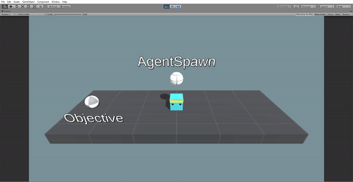
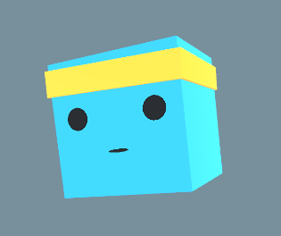
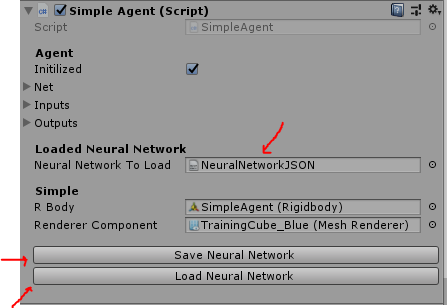

# UnityNeuralNetwork 
*Created by Eric Batlle Clavero*

 A simple **Unity project** that implements a **Genetic Unsupervised NeuralNetwork interface** and includes different and updated scenarios of how to implement it. 

Builded with **C#** from scratch, avoiding complex (and black-boxed) frameworks such as Tensorflow, or PyTorch.

## Video-Example 🎬

<p>
  
</p>

## Table of Contents 

- [⚙️ How to Use](#how-to-use)
- [🧬 Which kind of NeuralNetwork is this one](#which-kind-of-neuralnetwork-is-this-one)
- [🤖 What is an Agent](#what-is-an-agent)
- [🏋️‍♂️ How the Manager train the Agents](#how-the-manager-train-the-agents)
- [📜 UNN Explanations](#unn-explanations)
- [🧠 Transferable Brains](#transferable-brains)
- [Thanks](#thanks)

## How to Use ⚙️

If you want to open the project, you need to have **Unity** installed with the **2017 version or higher**.

Once you have Unity installed, **open the project**, select the example scene that you want and **click Play**.

If you only want to scratch the code, either inside the unity project or simply dragging the **.cs** classes on your editor, you have to watch on to the classes located on ``Assets/Scripts``. 

Scripts are divided in **3 folders:**

* ``UNN``, here are the important ones, it includes all the interfaces, classes and editor scripts to use and implement the agents, neural networks, managers, etc. More explained below on - [UNN Explanations](#unn-explanations).

* ``Utils``, includes a couple of scripts to facilitate some coding tasks like JSON serialization, or new Unity PropertyAttributes.

* ``Examples``, includes scripts used on the example scenes, really useful to see how to implement the scripts from ``UNN``.

## Which kind of NeuralNetwork is this one 🧬

The neural network used in this project is an **Unsupervised** one, meaning that you do not need to control (or supervise) the agents that is training. 
Instead you program them to work **on its own** to discover new ways to reach the objective.

It is also a **Genetic** neural network, meaning that the agents will be inflicted by operators which are bio-inspired. In this case they will be polished due to **Mutations** and **Selections**.

## What is an Agent 🤖
<p>
  
</p>

**Agents are the entities generated by the Manager** that will try to achieve the goal stablished by his own (the Manager).

Every Agent will **have his own NeuralNetwork** that acts as a brain. This NeuralNetwork will be the responsible to generate neural network outputs given some inputs. Those outputs will affect the behaviour of the Agent, for example, deciding the direction of his move.

**Life-cycle** of an Agent:

* **Collect environment information**. Such as the current position of the objective.
* **Set new inputs**. From the collected information.
* **Generate Outputs**. Based on the inputs introduced on the network.
* **Makes an Action**. Performs an output-based action, like increase agent speed or position.
* **Calculate his reward**. Depending of his action, the reward will be bigger or lower. This will be used to score the agent success.
* 🔄 **Restart the process**.

## How the Manager train the Agents 🏋️‍♂️

The behaviour of the scene will be controlled by a **Manager**, his behaviour will follow those steps:

* **Creates** a population of **agents**.
* **Scores** them depending of their behaviour.
* **Selects** after a while **the better half** of the agents based on their score.
* **Removes** the **worst half** of the population.
* **Duplicates** the remaining agents (**the first half**).
* **Mutates** the new **duplicated agents**.
* 🔄**Restart the process**.


## UNN Explanations 📜

UNN is the directory that contains the base classes to inherit or implement new functionalities if you want to extend your own scenario.

The scripts included on the directory, appart from the Editor ones are:

###``NeuralNetwork.cs``
This is the class structured to include the Neural Network topology, with layers, neurons and connections. It also includes the functionalities to Save and Load generated networks.

####``NeuralNetworkSerializer.cs`` 
This class is needed to serialize/deserialize NeuralNetworks cause Unity do not allow the automatically serialization of jagged array or complex structs. It also uses my own JsonManager, one of my [SimpleUnityUtils](https://github.com/ls29322/SimpleUnityUtils), explained and used on the repo.

The way to correctly **serialize and deserialize** a NeuralNetwork is the following: 

```cs

//Serialize
string jsonString = JsonManager.SerializeToJson<SerializableNeuralNetwork>(net.Serialized());

//Deserialize
SerializableNeuralNetwork sNet = JsonManager.DeserializeFromJson<SerializableNeuralNetwork>(jsonString);

```

### ``AgentsManager.cs``
This **abstract** class includes the training cycle explained in [How The Manager train the Agents](#how-the-manager-train-the-agents). The only thing to be aware is that even being an abstract class, there are 2 virtual functions that should be override if you want to extend this class:

```cs
/// <summary>
/// Create agent Game Object and set his parent.
/// Also set his neural network and the inputs it will use.
/// </summary>
/// <param name="agentNumber">Position of the agent in the current agents list</param>
/// <returns></returns>
protected virtual Agent CreateAgentGO(int agentNumber)

/// <summary>
/// Create agent Game Object and set his parent.
/// Also set his neural network and the inputs it will use.
/// The neural network is initially setted from an external neural network file.
/// </summary>
/// <param name="agentNumber"></param>
/// <param name="neuralNetworkToLoad"></param>
/// <returns></returns>
protected virtual Agent CreateAgentGO(int agentNumber, TextAsset neuralNetworkToLoad)
```

The 3rd overrideable method called **CreateSeparatedAgentGO()** is only needed in the  case that you don't want to use a Manager in your scene to create the agent spawned.

The Manager class can Start the training when the scene starts if the checkbox **trainOnStart** is marked, or if is not checked, it have an interactable buttons to start the train, to stop the training cycle, to restart it or to resume.

###  ``Agent.cs``

This abstract class includes all the agents life-cycle explained in [What is an Agent](#what-is-an-agent). It includes all the cycle abstract methods required to implement a new agent.

```cs
protected abstract void CollectEnvironmentInformation();
protected abstract void SetNewInputs();
protected abstract void AgentAction();
protected abstract float CalculateFitnessGain();
```

## Transferable Brains 🧠
All the agents NeuralNetworks can be serialized and deserialized, that means that you can leave an agent training, and then press the button **Save Neural Network** to store the trained neural network on a JSON file in the ``Assets`` directory.

This JSONed brain can be later introduced on a new agent, to let him start to learn from the point the other agent left. The way to do that is link the **TextAsset** JSON file into the **LoadedNeuralNetwork** editor variable space and press the button **Load Neural Network**.

<p>
  
</p>

## Thanks 
Some of the work here has been inspired from the project [ml-agents](https://github.com/Unity-Technologies/ml-agents) made it from the Unity people. In fact the appearance of the Simple3D agents is exactly the same as their own.

Also the bases to code this neural network in C# have been inspired from the Youtube videos created by 
 [Dani](https://www.youtube.com/channel/UCIabPXjvT5BVTxRDPCBBOOQ) and [TheOne](https://www.youtube.com/channel/UCWbkocGpP_8R5ZS1VpuusRA).